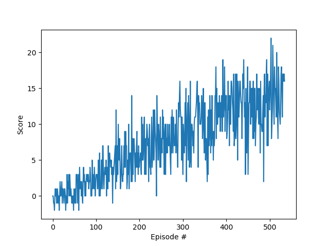

# Project 1 Report

See [README.md](README.md) for instructions.

## Problem

The problem involves a robot driving around an square room filled with randomly placed yellow and blue bananas.  Picking up a yellow banana is +1 points and picking up a blue banana is -1 points.  The states is 37-dimensional including the robots position and velocity along with perception data of the bananas in the vicinity.  The action space is 4-dimensional: (move forward, move backward, turn left, and turn right).

## Method

I solved this problem by implementing a Double Deep Q Network. I started from the [example DQN code](https://github.com/udacity/deep-reinforcement-learning/tree/master/dqn) from the DRLND lessons.  I adapted this code to interact with the unity env and upgraded learn() function to do [Double DQN](https://arxiv.org/abs/1509.06461).

## Results

My 100-episode average return is shown below.  The algorithm solves the problem (>=13) in around 500 episodes and produces the plot below:

## Future Work

Implementing a [Prioritized Experience Replay](https://arxiv.org/abs/1511.05952) would almost certainly improve the score quicker.  However the implementation isn't a simple one-line change like it was to go from DQN to Double DQN.  Also, efficient implementation requires a special data structure called a Sum Tree.  I found a good implementation for reference [here](https://github.com/rlcode/per).

An interesting alternative approach would be [Distributed Prioritized Experience Replay](https://arxiv.org/abs/1803.00933) which has been shown to drastically improve the efficieny and score in an arcade game environment setting.